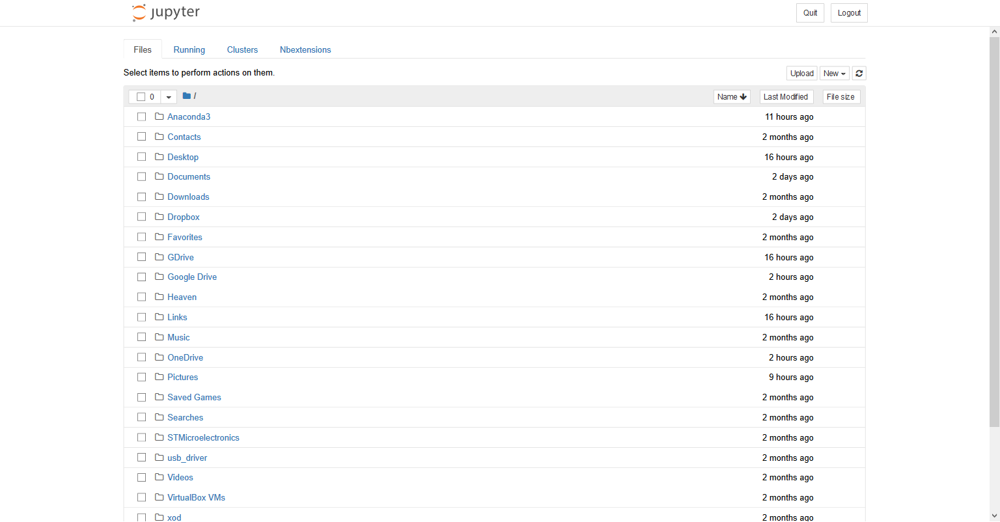
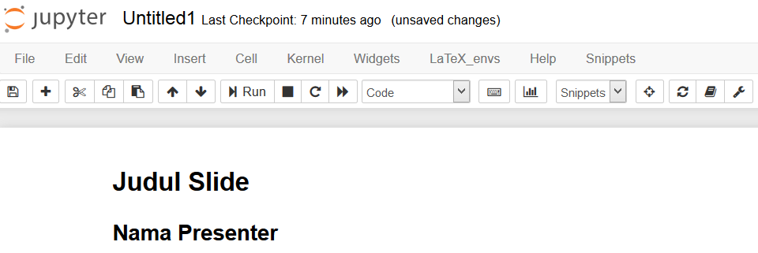
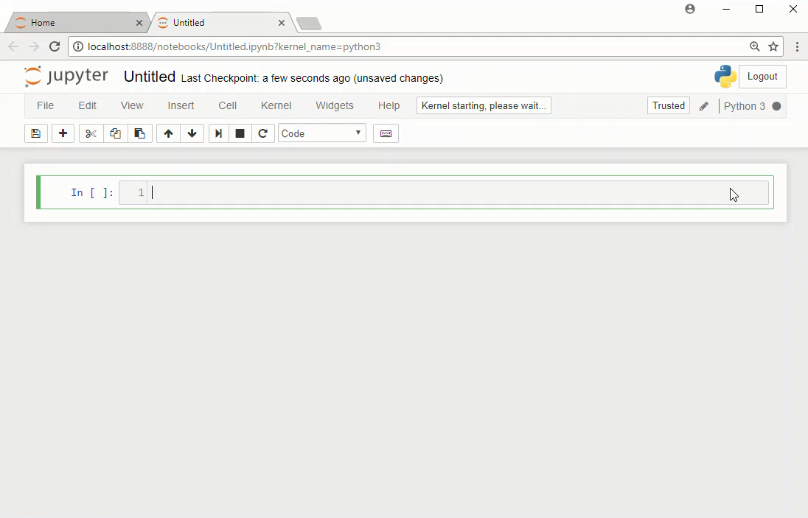
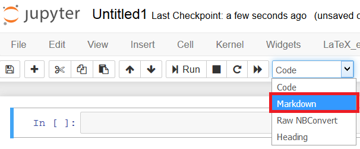

# 🐍 Python Programming Tutorial with Jupyter Notebook

> A complete beginner-friendly tutorial to learn **Python programming** interactively using **Jupyter Notebooks**. Designed with clear structure, visual guidance, and practical examples to help you build a strong Python foundation.

📘 **Ideal For:** Students, educators, self-learners, and workshop facilitators  
🧰 **Tools Used:** [Anaconda](https://www.anaconda.com/), [Jupyter Notebook](https://jupyter.org/), Python 3.x

---

## 📁 Project Structure

```plaintext
.
├── LICENSE
├── README.md
├── Tutorial/                 # Ordered Jupyter notebooks
│   ├── 0. Anaconda-Installation.ipynb
│   ├── 0. how-to-make-slide.ipynb
│   ├── 0.introducing.ipynb
│   ├── 1.basic-operator.ipynb
│   ├── 2.string.ipynb
│   ├── 3.list.ipynb
│   ├── 4.if,else.ipynb
│   ├── 5.for-loops.ipynb
│   ├── 6.for-loops,else,range,break.ipynb
│   └── 7.Classes-and-Objects.ipynb
└── image/                   # Screenshots and illustrations
    ├── anaconda.png
    ├── jupyter.png
    ├── jupyter-homepage.png
    ├── jupyter-notebook.png
    ├── markdown.png
    ├── chatbot.png
    ├── slide-01.png
    └── ...
```

---

## 🚀 Getting Started

1. **Install Anaconda**
   👉 Follow along with `0. Anaconda-Installation.ipynb` to set up your Python environment using Anaconda.

2. **Launch Jupyter Notebook**
   Open your terminal or Anaconda Navigator and run:

   ```bash
   jupyter notebook
   ```

3. **Browse & Run Notebooks**
   Open each `.ipynb` file sequentially under the `Tutorial` folder to follow the lessons.

4. **Turn into Slides (Optional)**
   Use `RISE` plugin to convert Jupyter Notebooks into presentation slides. See `0. how-to-make-slide.ipynb`.

---

## 🧠 What You'll Learn

| Topic                       | Notebook File                        |
| --------------------------- | ------------------------------------ |
| 📌 Python Overview          | `0.introducing.ipynb`                |
| 🧮 Operators & Expressions  | `1.basic-operator.ipynb`             |
| ✂️ Strings and Manipulation | `2.string.ipynb`                     |
| 📦 Lists & Collections      | `3.list.ipynb`                       |
| 🔀 Conditionals             | `4.if,else.ipynb`                    |
| 🔁 Loops and Iteration      | `5.for-loops.ipynb`                  |
| 🛑 break / range / else     | `6.for-loops,else,range,break.ipynb` |
| 🧱 OOP: Classes & Objects   | `7.Classes-and-Objects.ipynb`        |

---

## 🖼️ Screenshots

Some visual highlights from the tutorial:

| Jupyter Dashboard               | Slide Mode with RISE          |
| ------------------------------- | ----------------------------- |
|  |  |

| Cell Types                  | Markdown Example        |
| --------------------------- | ----------------------- |
|  |  |

---

## 💡 Why Use Jupyter for Learning Python?

* ✅ Interactive, beginner-friendly interface
* 📊 Supports text, code, visualizations in one place
* 🧑‍🏫 Ideal for live coding demos and self-paced learning
* 🖼️ Allows inline images and formatted explanations

---

## 📚 References

* [Jupyter Documentation](https://jupyter.org/)
* [Anaconda Download Page](https://www.anaconda.com/products/distribution)
* [Python Docs](https://docs.python.org/3/)

---

## 🙋‍♀️ Author

**Ardy Seto Priambodo**
📧 [2black0@gmail.com](mailto:2black0@gmail.com)
🔗 [github.com/2black0](https://github.com/2black0)

---

## 📜 License

This project is licensed under the [MIT License](LICENSE).

---

## 🌟 Show Some Love

If this helped your Python journey:

* ⭐ Star this repo
* 🍴 Fork it to make your own version
* 🧑‍🏫 Use it for your class, workshop, or learning club

> Learning Python should be fun and visual. Let's make it accessible together!